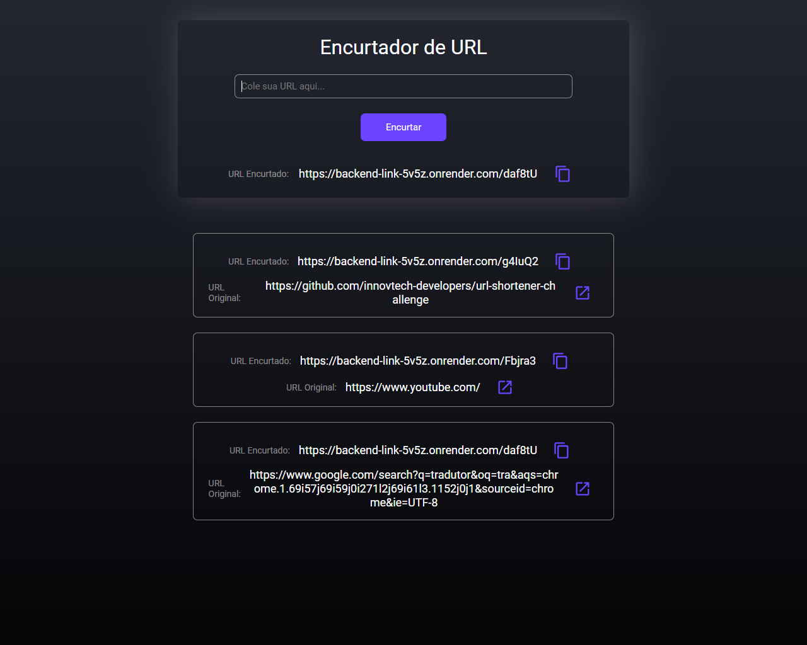
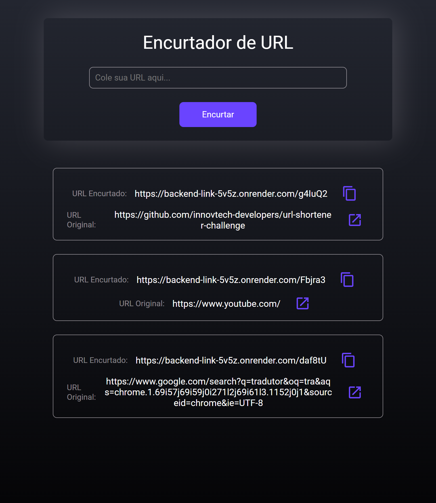
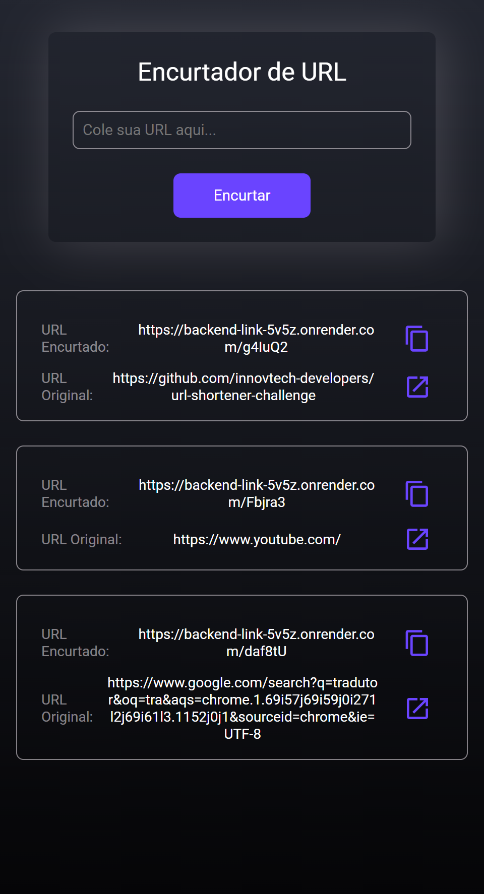

<h1 align="center">Encurtador de URL ✂</h1>

## Sobre 
Essa aplicação tem objetivo de encurtar a URL que desejar e armazenar todas as URL que já foram encurtadas.

<a href="https://github.com/wagnerSfarias/backend-link" target="_blank" >Documentação da API 📖</a>

<a href="https://encurtador-url-net.netlify.app/" target="_blank" >Link Site 💻</a>

<h2>Layout 🖥️</h2>

## Tecnologias utilizadas 👨🏻‍💻
- React
- Vite
- Axios
- Styled-components
- Mui/icons-material
- React-toastify